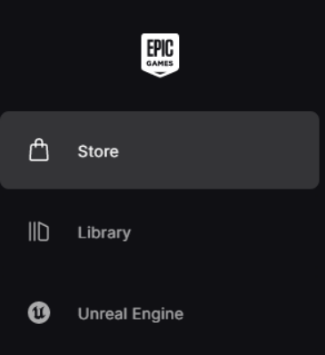
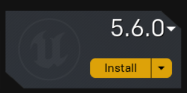
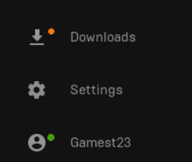
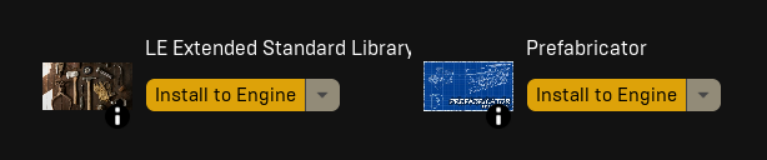
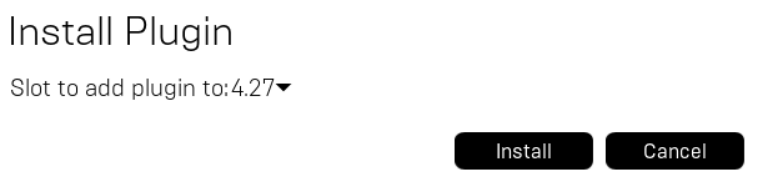

# First Time Setup | Unreal Engine

A lot of this guide uses elements of the [Custom Heist Track Tutorial](https://docs.google.com/document/d/1f6ComClQIJrvrdo5Yu-VmFC7ykKrs_8EyKiMkRRfbhc/edit?tab=t.0#heading=h.wjyyevobb0m0) made by [ershiozer](https://modworkshop.net/user/ershiozer), this would have not been possible without their guide.

This guide shortens it by a large amount.

If you already set up UE and Wwise, click here

Hey, I restarted my computer!

This guide will roughly take 40 GB of storage on your C: drive, ensure you have more than enough storage for this process.

← this is my C: drive! Hello!

First, we need a specific version of Unreal Engine. To install Unreal Engine, we need the [Epic Games Launcher](https://store.epicgames.com/en-US/download) (don’t worry, it won't add Fortnite to your account). Yes, you do need to make an account if you already don’t have one.

While you’re in the Epic Games Launcher, go ahead and claim the free game of the week on the Store tab of the app. You can do this every week, and it is a different game, just a gamer tip.

On the top left of the Epic Games Launcher, there will be 3 options. We want to select Unreal Engine.

Then at the top, there will be different tabs. Go ahead and click the “Library” option.

Near where you just clicked, there should be the option to install a new version of UE, click the plus sign and a new UE instance should appear grayed out.

We do not want the latest version of UE, as Payday 3 uses version 4.27.2

To change the version to install, click the version number and a small menu will appear with all the options. Just find 4.27.2 and click on it.

Then click install. A menu might pop up and say where you want to install this, just let it use the default location and click Install.

This might take a while, depending on your internet speed. You can check your install speed with the “Downloads” option in the lower left corner.

Once it is done installing, you want to go to this website. [https://www.fab.com/](https://www.fab.com/) 

Once on the website, click the person icon in the very top right.

It will prompt you to login into Epic Games, go ahead and do so.

You first want to add [LE Extended Standard Library](https://www.fab.com/listings/0aadd41b-c02d-4f63-9009-bffad0070ebc) to your library

As well the [Prefabricator](https://www.fab.com/listings/57a67b66-2248-48ba-a680-bb3e2e64d7e5) to your library

Once they are added, in the Epic Games Launcher, they should appear under the Fab Library

Click “Install to Engine” and install it to UE.

Do this to both.
Install time will vary depending on your internet speed.

Once done, we can move on to Wwise.