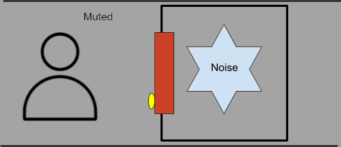
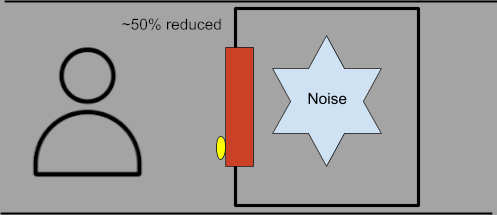

# Audio Obstruction

Guide Contributors/thanks: [ZeroZM0](https://modworkshop.net/user/zerozm) :Icons-mws_logo_white:

## Global Obstruction

We will now set up how audio will behave behind walls/floors.

We want to recreate the screenshot above, to do this click the >> on the left, then click “Game-Defined Auxiliary Sends HPF”. Do the same to make the “Game-Defined Auxiliary Sends LPF”.

Then click the >> that’s to the right of the things we just added, then go to Game Parameters > Default Work Unit > Global > global_obstruction

Do this to both HPF & LPF

It should create a line graph below, clicking on the “Game-Defined Auxiliary Sends HPF” or “Game-Defined Auxiliary Sends LPF” will show their respective graphs. For this, what we do to one graph, we must do to the other graph.

There are 3 ways of doing this, and will depend on how you want to do it personally. You can change the graph line with the 2 dots on either side, just click and drag them along the Y axis.

Completely mute the audio when it’s secluded
Good for voice lines/footsteps

“Muffle” audio when it’s secluded
Good for the radio lure

Or just ignore the rules entirely
This is mostly for UI elements and alarms, since we don’t need these rules for that

Remember to do this to both graphs!

Once done, go back to your guide to continue it.

