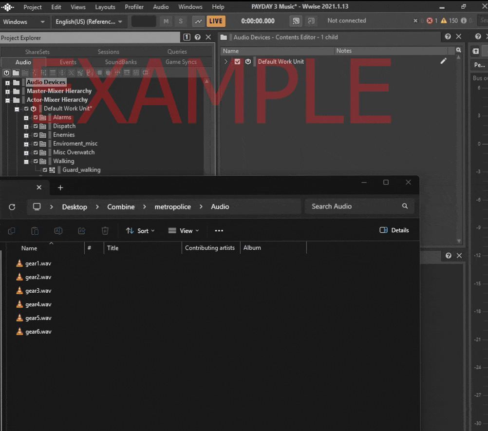
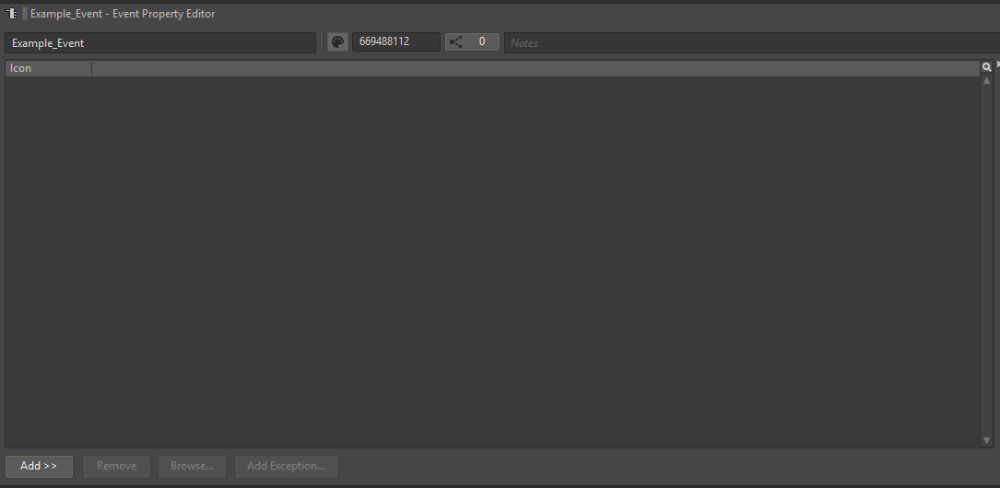

[1]: https://gamest23.github.io/PD3WwiseAudioModding/First%20Time%20Setup/UE%20Project/
[3]: https://gamest23.github.io/PD3WwiseAudioModding/WwiseInfo/WwiseInfo/

## Work Unit Download

Download this Work Unit:

[Alarms.wwu](Downloads/Alarms.wwu)

Open the project's directory and locate the "Actor-Mixer Hierarchy" folder. You want to place the downloaded Work Unit inside this folder.

Now open the Wwise Project. If the Project was already opened, it may prompt to refresh/restart the app.

## Event(s)

Go into the Events tab. The following image of Events[^3^][3] is required* to be made, in order to replace the sound properly. You don't have to make every event if you don't want to replace the other SFXs listed. Still, please recreate the image in its folder structure, and naming.

In order of release and event:

----

**No Rest For The Wicked**

**Dirty Ice**

**Rock the Cradle**

**Under The Surphaze**

**Gold & Sharke**

**99 boxes**

**Turbid Station**

**First World Bank**

**Fear and Greed**

`bank_alarm_fade_start`

----

**Touch The Sky**

**Diamond District (street alarm)**

`Alarm_3_Blend`

----

**Syntax Error**

**Diamond District (street alarm)**

`DC_alarm_fade_start`

----

**Boys in Blue**

`FRT_alarm_fade_start_01`

----

**Houston Breakout**

`CHS_alarm_fade_start`

----

**Diamond District**

`DD_alarm_fade_start_01`

`DD_alarm_fade_start_02`

`DD_alarm_fade_start_03`

`DD_alarm_fade_start_04`

----

**Party Powder**

`BUST_Warehouse_alarm_fade_start`

----

**Delivery Charge**

`SHIYA_alarm`

----

**Shopping Spree**

`DEMA_alarm_fade_start`

----

We'll come back to these events later.

Now go into the Audio tab, and find the "Actor-Mixer Hierarchy" section. 

Under the section should be the Work Unit you imported previously. It'll contain the containers that you import your audio (.wav) files into.

Due to how Wwise handles imports, there are 2 settings that need to be applied for the audio to both work and sound good.

We're editing these Containers:

## Output Bus

The first field that needs to be changed is the Output Bus

Click on the 3 dots next to it, and navigate to:

Master-Mixer Hierarchy > Default Work Unit > Master Audio Bus > Main > SFX > Environment

Select Alarms and click OK

## Global Obstruction

Next, go into the RTPC tab in the Container Property Editor

This tab will be responsible how much the audio will lower when it comes to walls, doors, and floors being in the way.

Due to how much this is up to you, this is a separate page entirely that can be [opened here](/PD3WwiseAudioModding/Audio Obstruction/Audio Obstruction/).

## Audio Importing

Importing audio is easy. From file explorer, select the audio you want to use, and drag it onto the respective Container.

A window will open on import settings, for this you want to import it as a ==Sound SFX==. Everything else can be left on its default setting.

If you want a preview of what to expect, Wwise has controls to play, pause, and stop the currently selected container/audio.

By default, the Random Containers[^3^][3] provided will loop 15 times. If you don't want this, change this field:

Once you're happy with your work, go back to the Events tab.

## Events, again

Open the events that were created previously, a window like this should be open:

On the bottom left, there's an option to "Add >>". Click on it, and click "Browse Object..."

Then search for the Container[^3^][3] that you want to play, whenever this event is triggered.

Once you find it, select and press OK.

Go ahead and do this to the other potential events.

## Paking

Press ++ctrl+s++ to save, and open the Unreal Engine Project you downloaded in First Time Setup[^1^][1]

Proceed to "[Paking Your Mod](/PD3WwiseAudioModding/UE Paking/Generate Sound Data/)" on the left hand side of the page