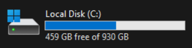

# Disclaimer

A lot of this guide uses elements of the [Custom Heist Track Tutorial](https://docs.google.com/document/d/1f6ComClQIJrvrdo5Yu-VmFC7ykKrs_8EyKiMkRRfbhc/edit?tab=t.0#heading=h.wjyyevobb0m0) made by [ershiozer](https://modworkshop.net/user/ershiozer), this would have not been possible without their guide.

This guide shortens it by a large amount.

This guide will roughly take `40 GB` of storage on your C: drive, ensure you have more than enough storage for this process.

← this is my C: drive! Hello!

You could install apps/project files like the Unreal Engine, Wwise Project, and PD3UEProject somewhere other than the C: drive. Though errors you may encounter will require some low-level PC knowledge to be fixed.

This process also **requires** admin privilege access on your windows device

Next Page >>