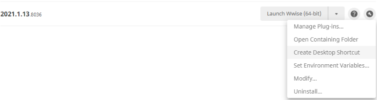
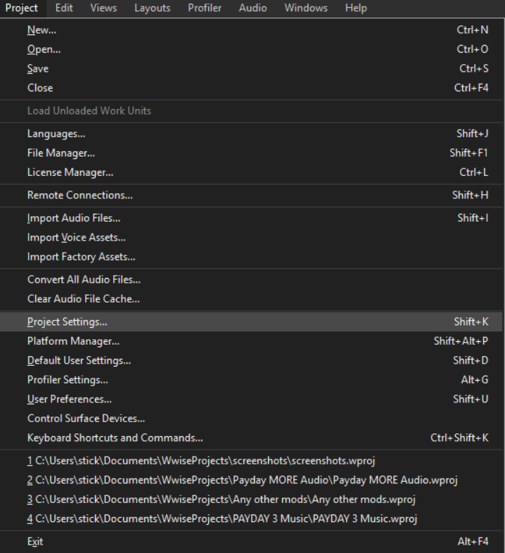
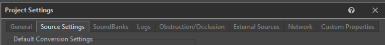
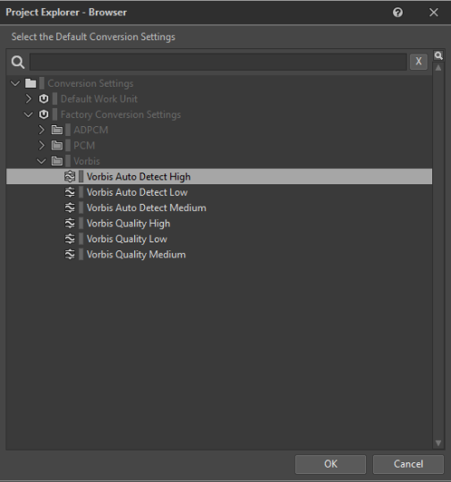

# Post Restart

Open the Audiokinetic Launcher again, and go back to the Wwise tab on the left. Under the Installed Versions will be the version you previously installed, click the wrench icon to the right of it and add a desktop shortcut.

This skips needing to open the Audiokinetic Launcher everytime you want to open Wwise. Now click Launch Wwise (64-bit) and close the Launcher.

At the bottom, you want to click on New… and name the project whatever you want. Click OK when you’re done.

If a pop-up appears, click close.

At the top left, click Project then Project settings. (or press Shift + K)

Click the Source Settings tab at the top

Click the three dots next to “Default Conversion Settings”, then follow this path:

Conversion Settings > Factory Conversion Settings > Vorbis > Vorbis Auto Detect High

Select Vorbis Auto Detect High, and click OK
Click OK for project settings.
To save your project, press Ctrl + S

## THIS SECTION WILL BE REPLACED WITH A SIMPLE DOWNLOAD

Wwise first time setup

In the “Audio” tab in Wwise, please recreate the following screenshot
If you need help recognizing these icons, click here

In the “Game Syncs” tab, please recreate the following screenshot

Double click “global_obstruction” and change the values to the screenshot below

And you’re all set!

If this is your very first time doing this, I recommend you start with the Walking tutorial just as a starter of getting familiar with these tools

Whenever you are doing any guide, keep both Wwise and Unreal Engine open.

Time to go back and have fun!