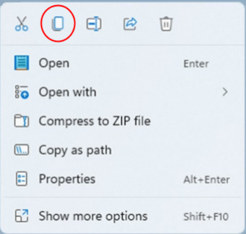
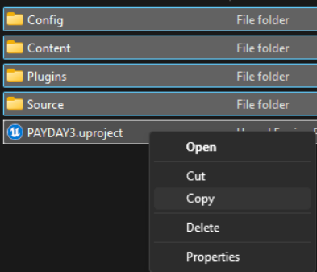
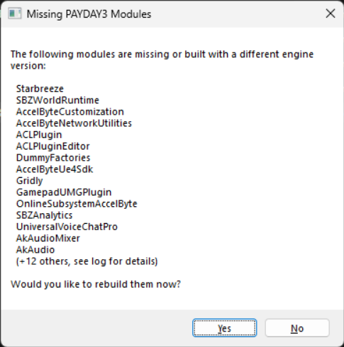
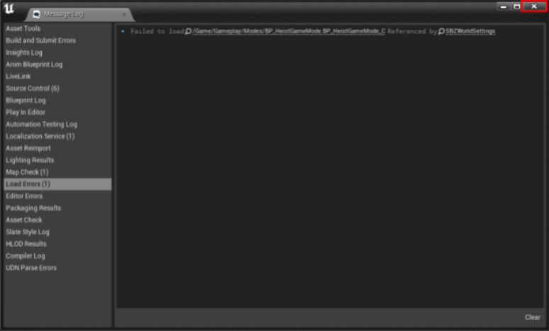
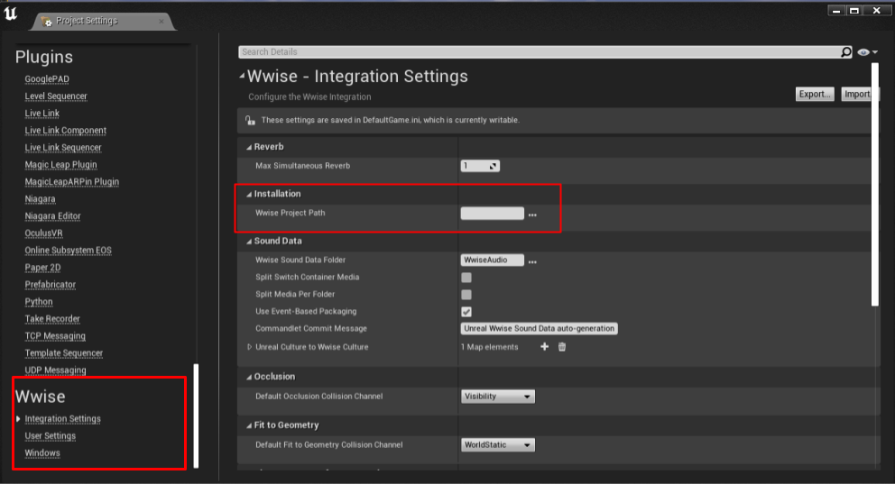
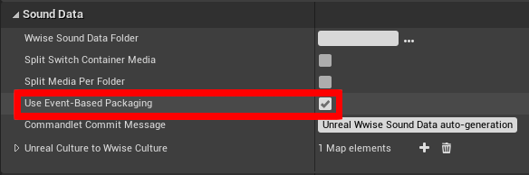
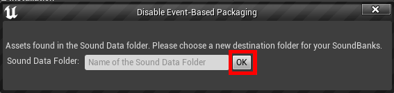
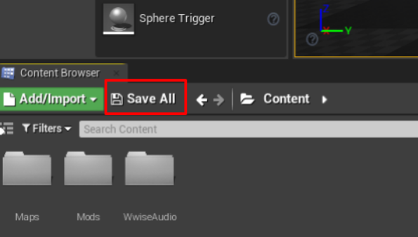

# PD3 Audio UE Project

Download this [.zip file](https://github.com/Gamest23/PD3AudioModdingUEProject/archive/refs/heads/main.zip) [:simple-github:](https://github.com/Gamest23/PD3AudioModdingUEProject) to your computer. (it’s  1.2 GB so wait a little)

Once done, open the .zip file. Make a folder on your desktop (name it whatever you want) and put the contents of that .zip file inside that new folder.
You can extract the contents by selecting all of them, right click, copy files, right click inside the new folder, and paste.

 Windows 11 right click copy

Alt. Right click menu copy

Once it’s in a new folder, double-click the PAYDAY3.uproject to open the UE project. A pop-up will appear, click Yes.

This process will take some time, speed will be dependent on how fast your CPU is.

----

If a pop-up does not appear, and doesn't know what app to open for this file format. First open Epic Games and into the Unreal Engine tab, there should be a prompt to have this file extension open Unreal Engine by default.

If there isn’t, go into windows settings, Apps, then Default Apps. At the top, search for .uproject and something similar to the image should appear.

Click on the available option, scroll down to “Choose an app on your PC” and browse to:

`C:\Program Files\EpicGames\UE_4.27\Engine\Binaries\Win64`

This is where Unreal Engine is installed by default. If you installed it somewhere else, go to where you specifically installed it and follow the folder path above starting at UE_4.27

Within that folder, there is a .exe file named “UE4Editor.exe” either double click it, or select it with a left click and click open. You should now be able to open that .uproject file now.

----

Once it launches, it will ask you if you want to set up your wwise settings, click Yes.

 If this appears, just close it.

On the left column, scroll all the way to the bottom to see the Wwise section.

Click Integration Settings, and look for the Installation section.

Click the 3 dots on the right side of the empty box, and it will open file explorer

Navigate to the Wwise Project you just downloaded and extracted from the previous page.

And double-click the .wproj file inside.

Close the pop-up(s), ignore the prompt for restart.

Find the option "Use Event-Based Packaging", and untick it. A prompt should open, just click OK.

Now go into User Settings

And enable "Auto Connect to WAAPI"

Go back into Integration Settings, and have this field have `WwiseAudio`

And re-enable "Use Event-Based Packaging", there should be a prompt to delete the `Init.bank`, go ahead an do so.

Click “Save All”, then “Save Selected”

Restart Unreal Engine (close Unreal Engine and re-open the PAYDAY3.uproject file)

Go back into the Project Settings (Edit > Project Settings)

Go to User Settings under Wwise, scroll to the bottom on the left side. Check if "Auto Connect to WAAPI" was disabled. If it was, re-enable it.

And enable, “Enable Automatic Asset Synchronization”.

Do one more restart of the Unreal Engine Project.

And you're done! Browse the available guides on the left and get to moddin!

I recommend you have both the Wwise Project, and Unreal Engine Project open at the same time whenever you are following a guide.

There are some tips on the next page for stuff like, making multiple mods on a single Wwise Project and more!