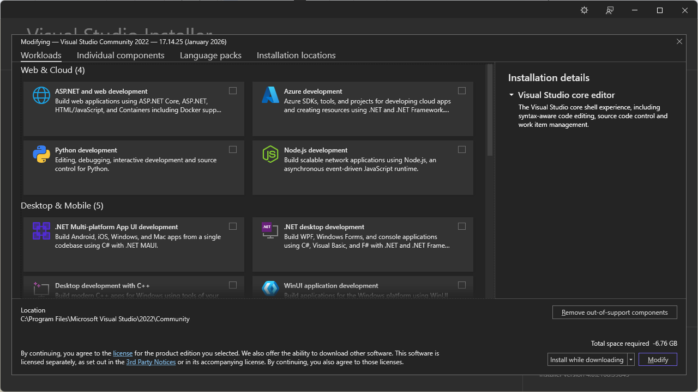
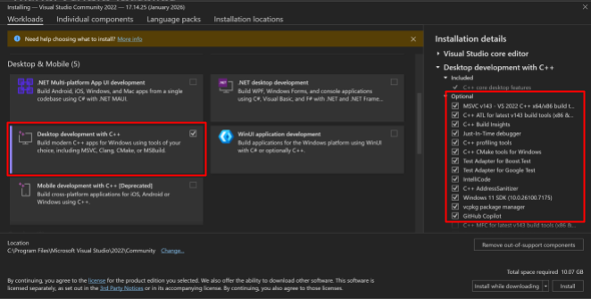
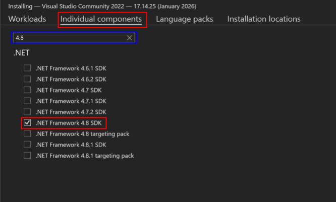

# Visual Studio

Download the installer [here](https://c2rsetup.officeapps.live.com/c2r/downloadVS.aspx?sku=community&channel=Release&version=VS2022&source=VSLandingPage&cid=2030:084c1b134b364f3f90596b7f7010f501)

Open the installer, and go through the initial steps until you reach a screen like this:

Find “Desktop development with C++” and click on it, make sure you have the following checked on the right (it may already be checked by default)

Then go into the Individual Components tab at the top, and search for “4.8”. Then check off the “.NET Framework 4.8 SDK”

Then click Install on the bottom right. This install will take a while.

Next Page >>