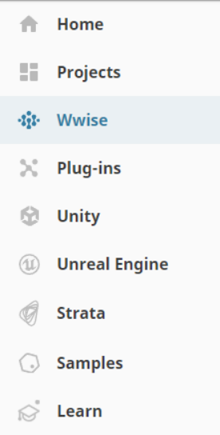
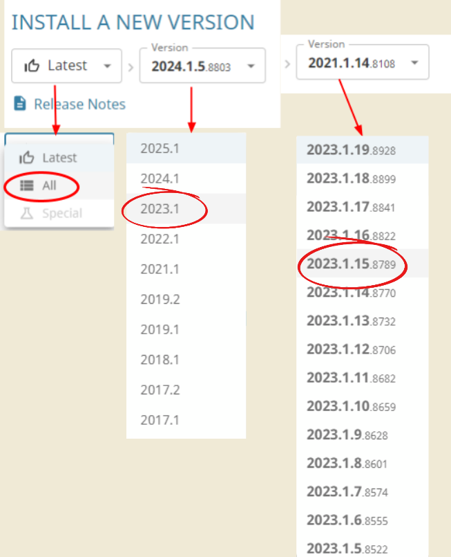
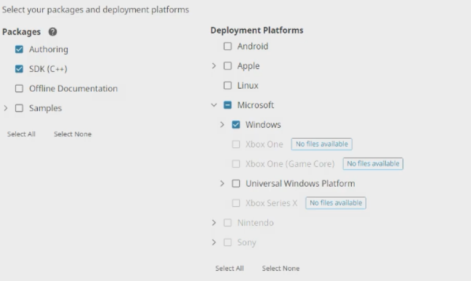
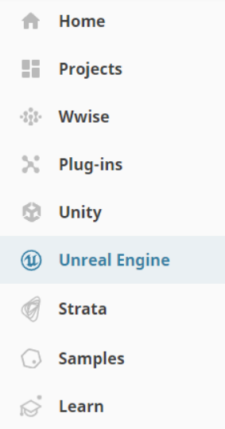
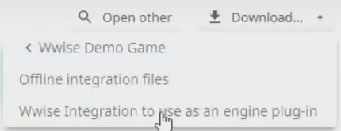
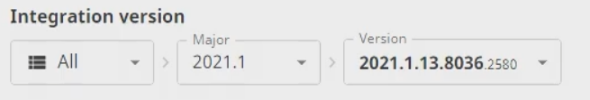
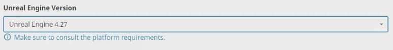

# Wwise

Go ahead and install the [AudioKinetic Launcher](https://www.audiokinetic.com/en/download/). Yes, you do have to make an account with them to install and “activate” the launcher. (make sure to remember your login information, since you need it later)

Once you can download the .exe file, open it and go through the installer.

With the launcher installed and now open, click the “Log in” option at the top right of the app to login. Make sure the “Keep me logged in” option has a blue checkmark.

On the left side, there is a Wwise tab, click it

At the bottom where it says to Install A New Version, change Latest to All

Then under Major, select version 2021.1

Then under Version, select version 2021.1.13.8036

Then click Install

In the new menu, you want to make sure the following has a blue check mark:

Authoring

SDK (C++)

Windows

Then click Next. Ignore the next screen and click Install. And accept.

This also might take a while, depending on your internet speed.

Once the download is done, go to the Unreal Engine tab on the left

On the top right will be a Download… option, click it and click on the “Wwise Integration to use as an engine plug-in”

In the new menu, you want to replicate the version settings from before under the Integration version section.

Then under the Unreal Engine Version section, select Unreal Engine 4.27

Verify the fields, click download and accept.

At this point, we have done a lot, to make sure everything will work smoothly, go ahead and restart your computer and continue.

Next Page >>