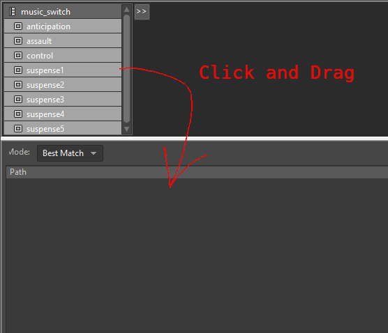
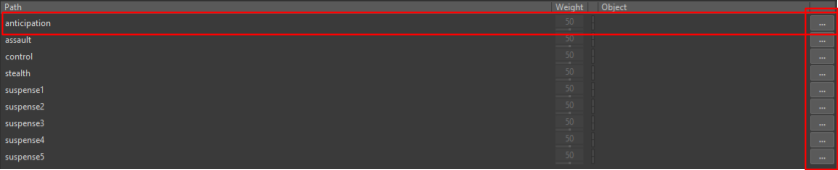
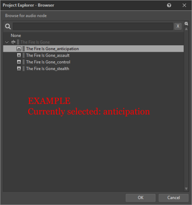
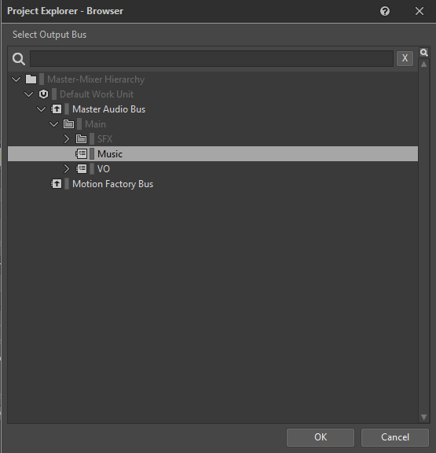
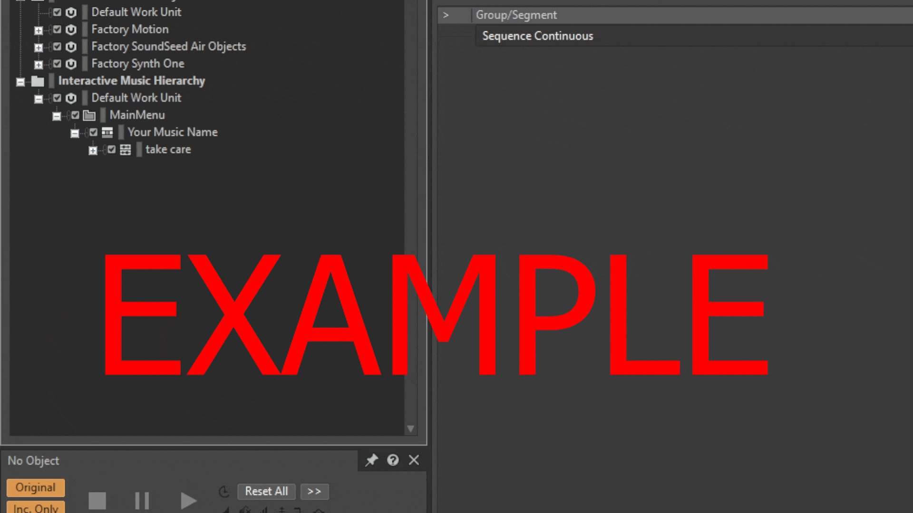
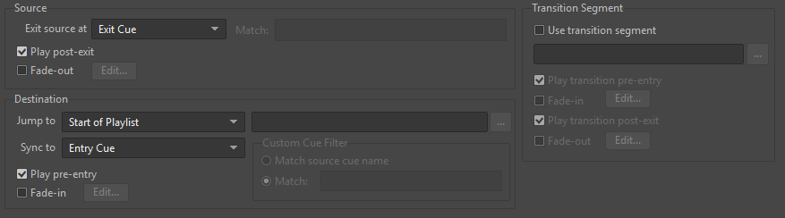

[1]: https://gamest23.github.io/PD3WwiseAudioModding/First%20Time%20Setup/UE%20Project/
[3]: https://gamest23.github.io/PD3WwiseAudioModding/WwiseInfo/WwiseInfo/

This guide is an add-on to [Updated Heist Jukebox](https://modworkshop.net/mod/48329) :Icons-mws_logo_white:

Guide Contributors/thanks: [ershiozer](https://modworkshop.net/user/ershiozer) :Icons-mws_logo_white: [ZeroZM0](https://modworkshop.net/user/zerozm) :Icons-mws_logo_white:

## Work Unit Download

There is no Work Unit download for this guide.

## Event(s)

Go into the Events tab, and make a new Work Unit under the folder "Events". Name the folder your online username. If you already have a work unit like this, you don't need to make another.

Then inside that new Work Unit, make a new Event and name it after the music you plan on using.

An example of this:

We'll come back to this event later.

## Interactive Music Hierarchy

Go into the "Audio" tab and look for the "Interactive Music Hierarchy" folder.

In the Default Work Unit, make a Music Switch Container[^3^][3] and name it after the name of the music you are using.

Then make at least 4 Music Playlist Containers[^3^][3], each named:

- Anticipation

- Assault

- Control

- Stealth

If you believe you can do stealth suspense with your music, then add the needed amount of stages that would fit your music:

- Suspense1

- Suspense2

- Suspense3

- Suspense4

- Suspense5

If you are using these, then remove the Stealth Music Playlist Container you made.

Selecting the Music Switch Container you made, you should see a menu like this:

If you don't, press ++left-shift+w++

Underneath "Add Generic Path", there are two arrows >>

Click on it, then navigate to:

Switch Groups >

Click on music_switch

With the new switches added, select all of them, click and drag them to the lower half of the editor. Make sure you don't also have "music_switch" selected as well.

You can see the names of the switches on the left, and on the very right of them you can see three dots "..."

Click on the three dots for a switch, and navigate to its similarly named Music Playlist Container[^3^][3].

Select the correct one, and click OK.

If you didn't make the Suspense Music Playlist Containers[^3^][3], use the Stealth Music Playlist Container[^3^][3] for all suspense switches.

## Output Bus

The output bus needs to be changed in order for proper play in-game.

With the Music Switch Container[^3^][3] selected, find this field:

Click on the 3 dots next to it, and navigate to:

Master-Mixer Hierarchy > Default Work Unit > Master Audio Bus > Main

Select Music and click OK

## Audio Importing

Importing audio is easy. From file explorer, select the (.wav) audio you want to use, and drag it onto the respective Container.

A window will open on import settings. Everything can be left on its default setting, and click "Import".

Once your audio is imported to their proper Containers, click on one of the Music Playlist Containers[^3^][3].

## Playlist Sorting

You need to click and drag your imported Music Segments[^3^][3], into the Music Playlist Editor[^3^][3].

The Container plays the audio in order from top to bottom by default. So go ahead and organize it if you have multiple audio files playing, like an intro and loop if you have them.

To the right side of the Music Segments[^3^][3] inside the editor is a "Loop Count". Pressing down from the value of "1" will make it loop indefinitely, don't worry about it not being able to stop as of right now.

You do need to at least make one of the Music Segments[^3^][3] loop indefinitely, to avoid it stopping when it runs out of runtime.

You need to do this to the other Music Playlist Containers.

Once done, select the Music Switch Container[^3^][3] for transitions.

## Transitions

Transitions is the controlled behavior whenever the game changes states. Like when it goes from stealth to control, a transition is responsible of what it should do.

Going into the Transitions tab, here you can either be creative with this, or do the fastest/lazy way.

The transition that it comes with, is the default/fallback. Whenever there isn't a dedicated transition, it will use this instead.

You can create more Transitions on the right side.

With new Transitions, you can select its source with the >>, which can either be a Container or Music Segment. And select a Destination.

The different sections, do different actions. You can see this when having a Transition selected.

## Transition Options

### Source

`Exit Source at:` determines how it should stop the Source audio for the transition. Whether it should end it immediately, next bar, etc.

There is also the option for it to fade-out when it stops the Source. **It must be configured for it to function the way you wish.**

### Transition Segment

This is used if you want a specific Music Segment[^3^][3] to play in-between the Source and Destination. With it's own set of properties to change like fade-in and out.

### Destination

`Jump to:` controls what Music Segment[^3^][3] to play inside the Music Playlist Container[^3^][3] in the Destination. **This is Disabled if a Music Segment[^3^][3] is selected for the Destination.**

`Sync to:` is to control how the start of the Destination Music Segment[^3^][3] should be, compared to the current runtime of the playing Source Music Segment[^3^][3]

There is also the option for it to fade-in when it starts the Destination. **It must be configured for it to function the way you wish.**

### Usage

Whether you need or want to use transitions is up to you. If you just want to have all your audio immediately transition, no fuss. Then you can just change the already provided transition's options like this:

`Exit source at:` Immediate

## Preview

To see your transitions in action, you can use the wwise player with the Music Switch Container[^3^][3] selected.

With the Switches tab open, you can change the current switch with the drop down menu. You can do this while the Container is currently playing, and is required to hear what the transitions sound like.

Take your time to make this as perfect as you want it.

## Events, again

Open the event that was created previously, a window like this should be open:

On the bottom left, there's an option to "Add >>". Click on it, and click "Browse Object..."

Then search for the Music Switch Container[^3^][3] that you made.

Once you find it, select and press OK.

## Paking

Press ++ctrl+s++ to save, and open the Unreal Engine Project you downloaded in First Time Setup[^1^][1]

Proceed to "[Paking Your Jukebox Mod](../UE%20Jukebox%20Paking/Making%20it%20an%20Add-on.md)"