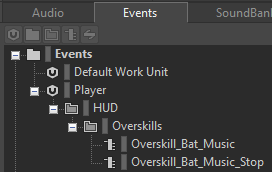
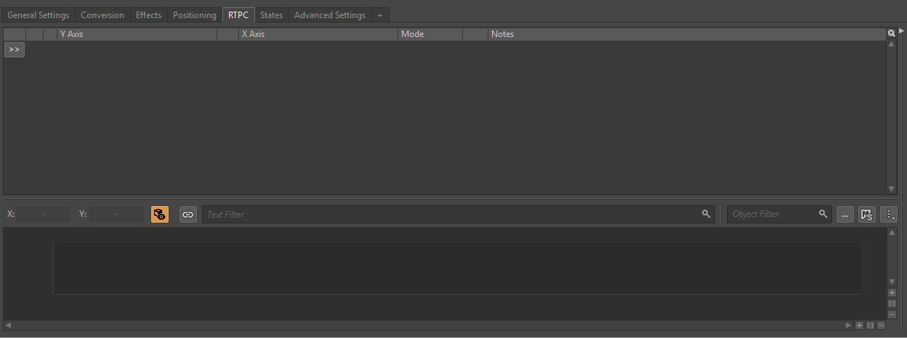
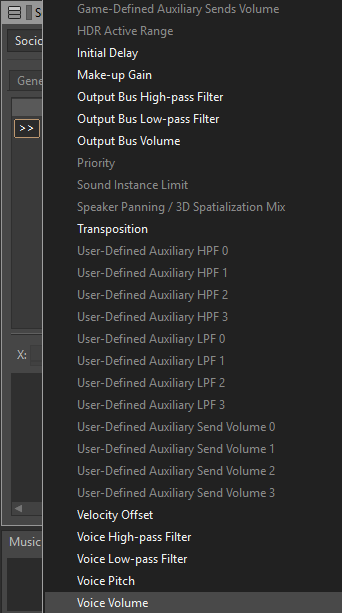
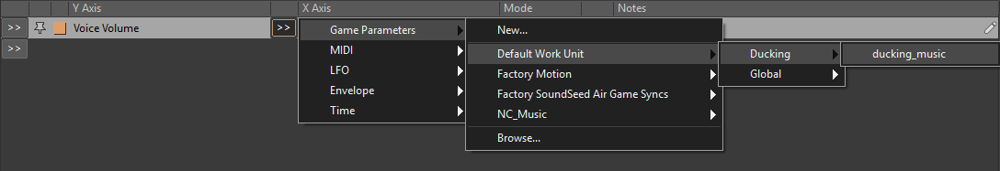
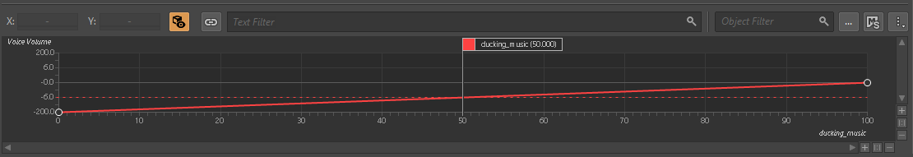
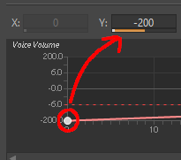
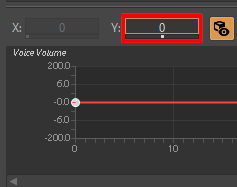
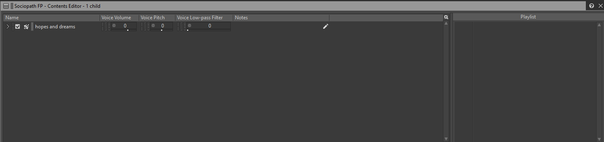
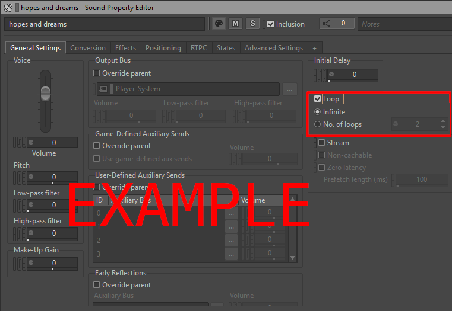

[1]: https://gamest23.github.io/PD3WwiseAudioModding/First%20Time%20Setup/UE%20Project/
[3]: https://gamest23.github.io/PD3WwiseAudioModding/WwiseInfo/WwiseInfo/

Guide Contributors/thanks: [ZeroZM0](https://modworkshop.net/user/zerozm) :Icons-mws_logo_white:

## Work Unit Download

Download this Work Unit:

[Sociopath.wwu](Downloads/Sociopath.wwu)

Open the project's directory and locate the "Actor-Mixer Hierarchy" folder. You want to place the downloaded Work Unit inside this folder.

Now open the Wwise Project. If the Project was already opened, it may prompt to refresh/restart the app.

## Event(s)

Go into the Events tab. The following image of Events[^3^][3] is required to be made, in order to replace the sound properly. Please recreate the image in its folder structure, and naming.

`Overskill_Bat_Music`

`Overskill_Bat_Music_Stop`

We'll come back to these events later.

Now go into the Audio tab, and find the "Actor-Mixer Hierarchy" section. 

Under the section should be the Work Unit you imported previously. It'll contain the containers that you import your audio (.wav) files into.

Due to how Wwise handles imports, there are several settings that need to be applied for the audio to both work and sound good.

We're editing these Containers:

## RTPC

Select the `Sociopath FP` Sequence Container[^3^][3]

Go into the RTPC tab in the Container Property Editor

Click the >> that's to the left, and click on Voice Volume

Then, next to that, click on the >> again, and do:

Game Parameters > Default Work Unit > Ducking > ducking_music

A graph should now form at the bottom.

Click on the dot on the left side of the line, and change the Y value to 0 (zero) to flat line it.

## Audio Importing

Importing audio is easy. From file explorer, select the audio you want to use, and drag it onto the respective Sequence Container's[^3^][3] that were previously shown in an image.

A window will open on import settings, for this you want to import it as a ==Sound SFX==. Everything else can be left on its default setting.

### Sequence Containers

For Sequence Containers[^3^][3], the imported audio needs to be in its playlist for it to play. This gives control on what order of audio you want to play.

Selecting the Container will have an editor like this:

The left side is the audio inside the container you imported, the right side being the playlist. To add your audio to the playlist, you click and drag the audio from the left, to the right.

The order it'll play in is from top, to bottom. You can change the order by clicking, and dragging them up and down.

### Make it loop

it is required to have one of the audio to loop indefinitely, don't worry about it being unable to stop.

Click on the audio your imported that you want to loop, and there's a section for looping. Simply check it off and you're good.

### Preview

If you want a preview of what to expect, Wwise has controls to play, pause, and stop the currently selected container/audio.

Select the Switch Container[^3^][3], and in the player go to the Switches tab. You can switch between first and third person from the switch.

Once you're happy with your work, go back to the Events tab.

## Events, again

Open the events that were created previously, a window like this should be open:

On the bottom left, there's an option to "Add >>". Click on it, and click "Browse Object..."

Then search for the Switch Container[^3^][3] that the Work Unit included.

Once you find it, select and press OK.

For the event that's labeled "Stop", it's slightly different. It needs to have the same container you selected for its similarly named Event, and have the type be "Stop" instead of "Play". You can change it in this field.

## Paking

Press ++ctrl+s++ to save, and open the Unreal Engine Project you downloaded in First Time Setup[^1^][1]

Proceed to "[Paking Your Mod](/PD3WwiseAudioModding/UE Paking/Generate Sound Data/)" on the left hand side of the page