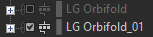
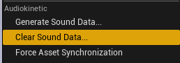
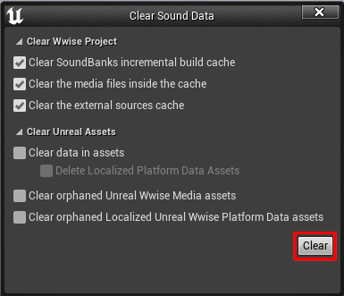

# Tips on using Wwise and Unreal

## Cool info

You do not *have* to follow the guides to completely mod an Wwise Event. The Event can play whatever you want, truly. You are using an audio engine after all, do what you please, truly!

The guides purpose is to either ease into Wwise, or for those that just want to replace audio with something of their choosing.

## Multiple mods, one project

Now, when you are making multiple different mods, under the same Wwise Project. Generating the assets within Unreal Engine will generate assets from your previous work as well, especially your media files. If not careful, you can accidentally leave previous works into your current mod.

You don't have to delete your previous work, since anything can still happen that will require that work. If it breaks suddenly, if someone has a suggestion for it, or you just aren't happy with it.

In Wwise, next to your Containers is a checkable box. You uncheck the one's that you no longer are using for your current project. You don't have to worry about the Events you make, since if an Event doesn't have an active container to play, it wont generate in Unreal Engine.

Next will be to ensure files previously generated in Unreal Engine, aren't being cooked. In Unreal Engine, you want to:

- "Generate Sound Data" and "Generate"

- "Save All"

- "Clear Sound Data" then "Clear"

- Should be a prompt to delete, go ahead

- Then do one more "Generate Sound Data" and "Save All"

If it didn't remove them properly, do steps 1-3 again, but check every option available and continue.