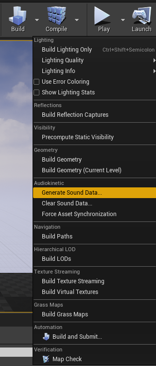
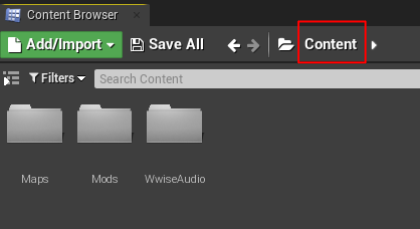
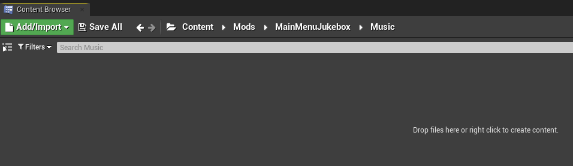
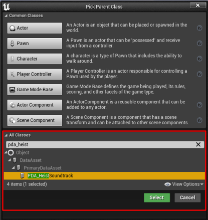
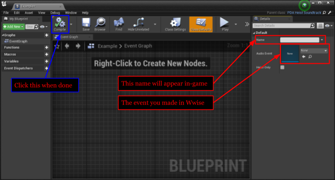

# Making it an Add-on

## Generate Sound Data...

In Unreal Engine, you want to click the arrow next to “Build” at the top some-what right side. In the new menu that pops up, you want to click “Generate Sound Data…”

A menu should pop up, you want to click on “Generate”

Once it’s done, you want to click on “Save All” in the lower left of Unreal Engine, then click “Save Selected”.

Since this is an add-on for the Updated Heist Jukebox, the steps are different.

## The Add-on part

In the Content Browser, start here:

You can click "Content" to reach this spot

Browse to:

Mods > HeistJukebox > Music

Right click the empty space, and click `Blueprint Class`

With the new window that popped up, you want to search at the bottom for `PDA_HeistSoundtrack`

Click on it, and click Select

I recommend you name it starting with `PDA_` then your song name. You can rename it by selecting it, and pressing `F2`.

Open the new Blueprint by double-clicking on it.

The Name field will be the name that will appear in-game for the Jukebox Mod.

The Audio Event is going to be the Event you made for this. Click on the drop down, and search for the name you gave it.

Once you filled out both fields, click `Compile` on the top left.

You can close that editor.

Click on "Save All" in the lower left of Unreal Engine, then click “Save Selected”. Then it’s time to cook! (you’re almost there) click on “File” at the top left of Unreal Engine, and click “Cook Content for Windows” and wait for it to cook.

Next Page >>