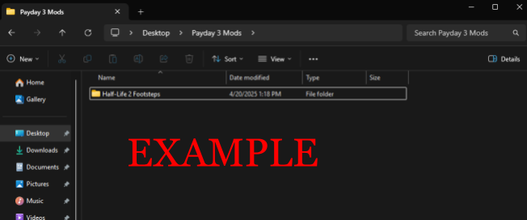
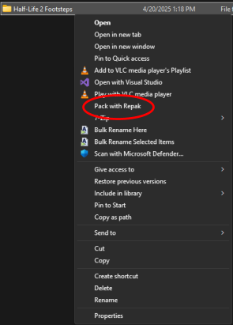

# Paking

It’ll give you a notification once it is done cooking, or the notification of “Cooking…” is gone. Now go to the Unreal Engine’s folder and follow this path starting from this screenshot.

Saved > Cooked > WindowsNoEditor > PAYDAY3 > Content > WwiseAudio 

----

You want to copy the Events and Media folders into that Wwise folder in your mod folder

`Example:`

Half-Life 2 > PAYDAY3 > Content > WwiseAudio > Events

Half-Life 2 > PAYDAY3 > Content > WwiseAudio > Media

----

Now navigate to:

Saved > Cooked > WindowsNoEditor > PAYDAY3 > Content > Mods > MainMenuJukebox > Music

Copy the Blueprint name's `.uasset` and `.uexp` to your mod's similar folder

`Example:`

Half-Life 2 > PAYDAY3 > Content > Mods > MainMenuJukebox > Music

----

Now time to pack! Go back to the start of your mod folder

Click on the folder itself, right-click, and click on the option of “Pack with Repak”

Give it some time, and there should be a new file called your [modname].pak

Now you can put this .pak file into your ~mods folder in Papaya 3 and test if you like your mod

PAYDAY3 > Content > Paks > ~mods
