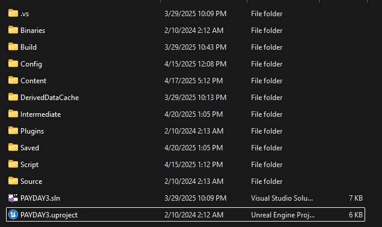
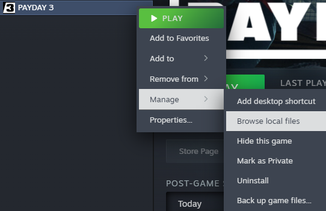

# Paking

It’ll give you a notification once it is done cooking, or the notification of “Cooking…” is gone. Now go to the Unreal Engine’s folder and follow this path starting from this screenshot.



Saved > Cooked > WindowsNoEditor > PAYDAY3 > Content > WwiseAudio 

----

If you used Sound SFX or Music Containers, you want to copy Events and Media folders into that Wwise folder in your mod folder

```Example:```

Half-Life 2 Footsteps > PAYDAY3 > Content > WwiseAudio >Events

Half-Life 2 Footsteps > PAYDAY3 > Content > WwiseAudio >Media

----

If you used Sound Voice, you want to copy Events and Localized folders into that Wwise folder in your mod folder

```Example:```

Half-Life 2 VO > PAYDAY3 > Content > WwiseAudio >Events

Half-Life 2 VO > PAYDAY3 > Content > WwiseAudio >Localized

----

Now time to pack! Go back to the start of your mod folder


Click on the folder itself, right-click, and click on the option of “Pack with Repak”


Give it some time, and there should be a new file called your [modname].pak

Now you can put this .pak file into your ~mods folder in Papaya 3 and test if you like your mod



PAYDAY3\Content\Paks\~mods
